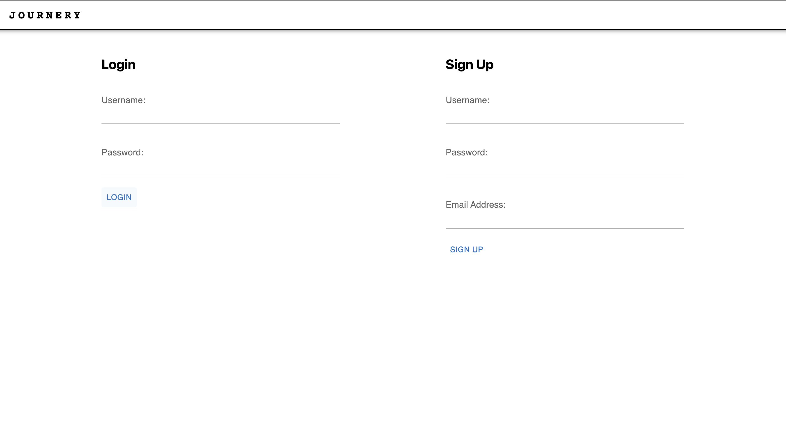

<div id="top"/>

# Journery
Journery is a photo journal app that keeps track of your journey in a world map. This was developed as an MVP with the term of 2 days.
Countries that you have already visited will be painted in pink. You can click on a country to create a new post or view all previous posts. Editing and deleting the posts are also possible. The application keeps track of your user information, as well as persist sessions, so there is no need to worry about logging in every refresh of the page.

## Table of Contents
- [Tech Stack](#tech-stack)
- [Product Features](#product-features)
  - [Login authentication with bcrypt hashing](#login-authentication-with-bcrypt)
  - [CRUD](#CRUD)
- [Getting Started](#getting-started)
  - [Installation](#installation)

## Tech Stack


## Product Features

### Login authentication with Bcrypt
> Users can login to an existing account or signup. Session is persisted with cookies.


### View, edit, create and delete posts

> Users can upload a new picture and post


> Users can view, edit and delete a post


## Getting Started

### Installation

From the root directory, run the following commands in your terminal.

1. To install all dependencies

```
npm install
```

2. To start dev server: open http://localhost:3000 to view it in your browser

```
npm run start-dev
```

3. To build for production

```
npm run build
```

4. To connect to the server: use http://localhost:3000 to verify the server connection
```
npm run start
```
